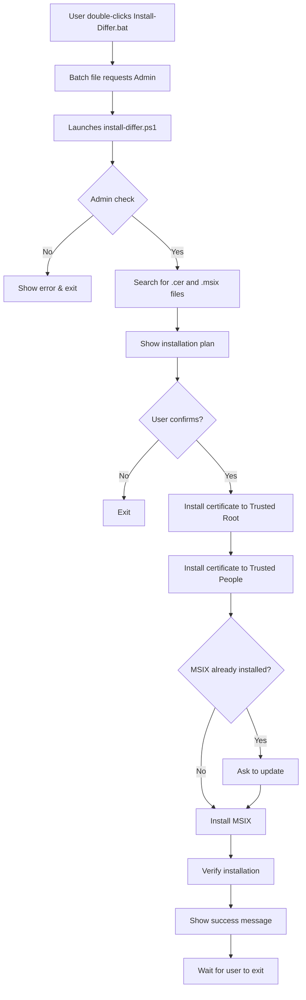

# One-Click MSIX Installation - Complete!

## ✅ What I Added

I've created a **one-click installation solution** that automates the entire MSIX setup process, including certificate installation!

### New Files Created

1. **`scripts/install-differ.ps1`** (16 KB)
   - Beautiful ASCII art banner
   - Automatic file discovery
   - Installs certificate to both Trusted Root and Trusted People
   - Installs MSIX package
   - Verifies installation
   - Handles existing installations (updates)
   - Full error handling and user feedback

2. **`scripts/Install-Differ.bat`** (1 KB)
   - Simple batch file launcher
   - Users can double-click it (no PowerShell knowledge needed!)
   - Automatically requests Administrator privileges
   - Launches the PowerShell installer

3. **`artifacts/README.md`** (Comprehensive user guide)
   - Three installation methods explained
   - File descriptions
   - FAQ section
   - Troubleshooting guide
   - System requirements

4. **Updated `scripts/create-release.ps1`**
   - Automatically copies both installer files to artifacts
   - Includes them in the release package

5. **Updated Documentation**
   - `README.md` - Highlights the one-click method
   - `INSTALLATION_GUIDE.md` - Added Quick Install section

---

## 🎯 User Experience: Before vs After

### Before (Manual Process)
```
1. Download 3 files
2. Open PowerShell as Admin
3. Navigate to downloads
4. Type complex command
5. Review certificate details
6. Confirm installation
7. Find and double-click MSIX
8. Click Install
```
**8 steps, command-line knowledge required** ❌

### After (One-Click)
```
1. Download 4 files
2. Put in same folder
3. Double-click Install-Differ.bat
4. Click "Yes" for Admin
5. Follow prompts
```
**5 steps, no technical knowledge needed** ✅

---

## 📦 Complete Release Package

Your releases now include:

### For MSIX Users (One-Click):
- `Install-Differ.bat` ⭐ **← Users start here**
- `install-differ.ps1` (auto-run by .bat)
- `Differ_0.2.0.0_x64.msix`
- `differ-signing-cert.cer`
- `README.md` (in artifacts, guide users)

### For Manual/Advanced Users:
- `install-certificate.ps1` (standalone certificate installer)
- All the above files

### For Portable Users:
- `Differ-v0.2.0-portable-win-x64.zip` (no installation needed)

---

## 🎨 Features of the One-Click Installer

### Visual Design
- ✅ Beautiful ASCII art banner
- ✅ Color-coded messages (Green=success, Red=error, Yellow=warning)
- ✅ Progress indicators
- ✅ Clear step-by-step feedback

### Intelligence
- ✅ Auto-discovers .msix and .cer files
- ✅ Checks for Administrator privileges
- ✅ Detects existing installations
- ✅ Offers to update/reinstall
- ✅ Skips steps if already done

### Error Handling
- ✅ Validates all files exist
- ✅ Clear error messages
- ✅ Helpful troubleshooting hints
- ✅ Graceful failures with explanations

### User-Friendly
- ✅ No command-line knowledge needed
- ✅ Shows what will be done before doing it
- ✅ Asks for confirmation
- ✅ "Press Enter to exit" waits for user

---

## 🚀 How It Works

### The Flow



### Technical Details

1. **Batch File Launcher**
   ```batch
   powershell -Command "Start-Process powershell -Verb RunAs -ArgumentList '...'"
   ```
   - Uses `Start-Process` with `-Verb RunAs` for UAC elevation
   - Passes the PS1 script path as argument
   - Original window can close immediately

2. **PowerShell Script**
   ```powershell
   # Check admin
   $isAdmin = ([Security.Principal.WindowsPrincipal]...).IsInRole(...)
   
   # Discover files
   Get-ChildItem -Filter "*.cer" -ErrorAction SilentlyContinue
   
   # Install certificate
   $store.Add($cert)
   
   # Install MSIX
   Add-AppxPackage -Path $MsixPath
   ```

---

## 📋 Distribution Instructions

### For Your Next Release

1. **Build the release:**
   ```powershell
   powershell scripts\create-release.ps1 -Version "0.2.0" `
      -CertificatePfxPath ".\differ-signing-cert.pfx" `
      -CertificatePassword "YourPassword"
   ```

2. **Create GitHub Release with these files:**
   ```
   artifacts/
   ├── Differ_0.2.0.0_x64.msix (71 MB)
   ├── differ-signing-cert.cer (1 KB)
   ├── install-differ.ps1 (16 KB)
   ├── Install-Differ.bat (1 KB)          ⭐ Highlight this!
   ├── install-certificate.ps1 (4 KB)     [optional for advanced users]
   ├── Differ-v0.2.0-portable-win-x64.zip (67 MB)
   └── README.md                           ⭐ Upload this too!
   ```

3. **Release Notes Template:**

```markdown
## 📥 Installation Options

### 🚀 Option 1: One-Click Installer (Easiest!)

**New! Super simple installation:**

1. Download these 4 files:
   - `Differ_0.2.0.0_x64.msix`
   - `differ-signing-cert.cer`
   - `install-differ.ps1`
   - `Install-Differ.bat` ⭐ **Start here!**

2. Put all files in the same folder

3. **Double-click `Install-Differ.bat`**

4. Click "Yes" for permission

5. Follow the prompts!

**That's it!** The installer handles everything automatically.

---

### 📦 Option 2: Portable Version

No installation needed! Just extract and run.

1. Download: `Differ-v0.2.0-portable-win-x64.zip`
2. Extract to any folder
3. Run `Differ.App.exe`

---

### 🔧 Option 3: Manual Installation

For advanced users who prefer step-by-step control.

See the included `README.md` for detailed instructions.

---

## 📖 Documentation

- **Quick Start:** See `README.md` in the release assets
- **Detailed Guide:** [Installation Guide](https://github.com/csseeker/differ/blob/master/docs/INSTALLATION_GUIDE.md)
- **Troubleshooting:** Check the FAQ in `README.md`
```

---

## ✨ Benefits Summary

### For Users
- ✅ **Easier:** 5 steps vs 8 steps
- ✅ **Faster:** One double-click vs multiple commands
- ✅ **Clearer:** Visual feedback and progress
- ✅ **Safer:** Automatic file discovery (no typos)
- ✅ **Friendlier:** No command-line intimidation

### For You (Developer)
- ✅ **Fewer support requests:** Clear instructions and automated process
- ✅ **Better UX:** Professional-looking installer
- ✅ **More adoption:** Lower barrier to entry
- ✅ **Automated:** Release script includes everything
- ✅ **Well-documented:** Comprehensive guides included

### For Advanced Users
- ✅ **Still available:** Manual method documented
- ✅ **Portable option:** No installation at all
- ✅ **Flexible:** Can use any method they prefer

---

## 🎓 What Users Will See

When they run `Install-Differ.bat`:

```
╔══════════════════════════════════════════════════════════════╗
║                                                              ║
║   ██████╗ ██╗███████╗███████╗███████╗██████╗               ║
║   ██╔══██╗██║██╔════╝██╔════╝██╔════╝██╔══██╗              ║
║   ██║  ██║██║█████╗  █████╗  █████╗  ██████╔╝              ║
║   ██║  ██║██║██╔══╝  ██╔══╝  ██╔══╝  ██╔══██╗              ║
║   ██████╔╝██║██║     ██║     ███████╗██║  ██║              ║
║   ╚═════╝ ╚═╝╚═╝     ╚═╝     ╚══════╝╚═╝  ╚═╝              ║
║                                                              ║
║           Complete Installation Script v1.0                  ║
║                                                              ║
╚══════════════════════════════════════════════════════════════╝

[✓] Running with Administrator privileges

[*] Looking for certificate file...
[✓] Found: differ-signing-cert.cer

[*] Looking for MSIX package...
[✓] Found: Differ_0.2.0.0_x64.msix

═══════════════════════════════════════════════════════════════
 Installation Plan
═══════════════════════════════════════════════════════════════

  Certificate: differ-signing-cert.cer
  MSIX Package: Differ_0.2.0.0_x64.msix

  This script will:
    1. Install the code signing certificate to Trusted Root
    2. Install the code signing certificate to Trusted People
    3. Install the Differ MSIX package
    4. Verify the installation

═══════════════════════════════════════════════════════════════

Do you want to continue? (Y/N): _
```

**Clean, professional, and reassuring!**

---

## 🔄 Testing Checklist

Before releasing, test:

- [ ] Download all 4 files to a test folder
- [ ] Double-click `Install-Differ.bat`
- [ ] Verify UAC prompt appears
- [ ] Confirm installation completes successfully
- [ ] Verify Differ appears in Start Menu
- [ ] Launch Differ and test functionality
- [ ] Test update scenario (install over existing)
- [ ] Test cancellation at confirmation prompt
- [ ] Test with files in different folder
- [ ] Test on clean Windows 10/11 VM

---

## 🎉 Summary

You now have **three installation methods** for maximum user flexibility:

1. **One-Click Installer** - For non-technical users (new!)
2. **Portable ZIP** - For users who don't want installation
3. **Manual MSIX** - For advanced users and IT admins

The certificate issue is fully resolved, and the installation experience is now **as simple as it gets**!

**Users can literally:**
1. Download 4 files
2. Double-click one file
3. Click "Yes"
4. Done!

🚀 Ready for your next release!
